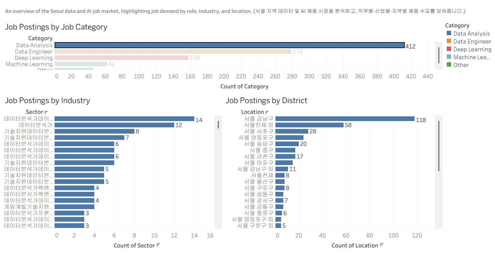
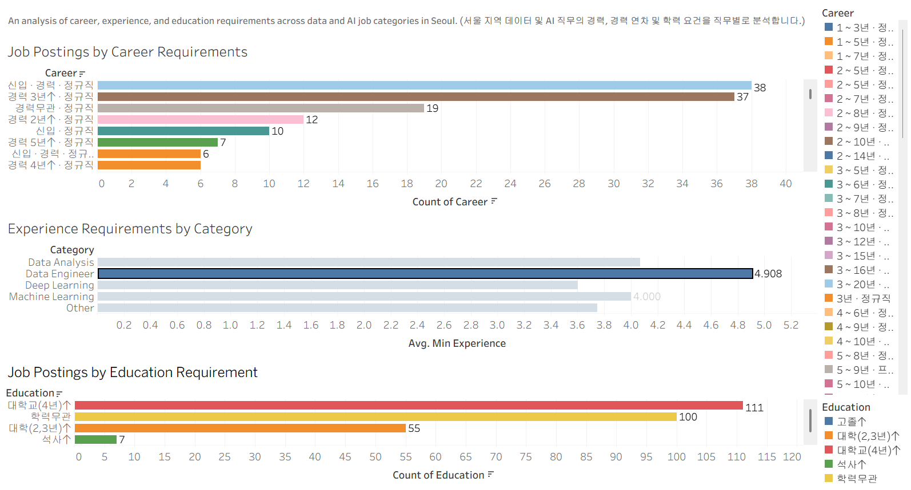

# 💼 Seoul Data & AI Job Market Analysis

This project analyzes the Seoul data and AI job market using publicly accessible job postings collected from Saramin.
The analysis focuses on Data Analyst, Data Engineer, Machine Learning, and Deep Learning positions.

이 프로젝트는 사람인에서 공개적으로 확인할 수 있는 채용 공고 데이터를 수집하여 서울 지역의 데이터 및 AI 채용 시장을 분석한 프로젝트이다.
Data Analyst, Data Engineer, Machine Learning, Deep Learning 직무를 중심으로 채용 현황을 분석했다.

## 📌 Project Overview

- Job postings were collected through web scraping from Saramin, focusing on Data Analysis, Data Engineering, Deep Learning, and Machine Learning positions across Seoul.
- A total of 957 job postings were collected and organized into key fields including company, job title, sector, location, career, and education.
- The collected data was cleaned and analyzed using SQL to answer business questions, followed by Tableau visualization.

- 사람인 웹사이트에서 서울 지역의 Data Analysis, Data Engineering, Deep Learning 및 Machine Learning 직무를 대상으로 채용 공고를 웹 스크래핑했다.
- 총 957개의 채용 공고를 수집했으며, 기업명, 채용 직무, 업종, 근무 지역, 경력, 학력 등의 주요 정보를 정리했다.
- 수집한 데이터를 전처리한 후 SQL을 활용하여 비즈니스 질문을 분석하고, Tableau를 통해 대시보드를 제작했다.

## 🔍 Business Questions

- Which data and AI job categories have the most job postings?
  데이터 및 AI 직무 중 채용 공고가 가장 많은 직무는 무엇인가?

- Which industries have the highest demand for data and AI roles?
  데이터 및 AI 직무의 채용 수요가 높은 산업은 무엇인가?

- Which locations in Seoul have the most job opportunities?
  서울 지역 중 채용 공고가 가장 많은 지역은 어디인가?

- What level of experience is most commonly required?
  가장 많이 요구되는 경력 수준은 무엇인가?

- What are the major career and education requirements for data and AI jobs?
  데이터 및 AI 직무에서 주로 요구되는 경력 및 학력 조건은 무엇인가?

## 🛠️ Tools

**Web Scraping** — Python, BeautifulSoup, Requests  
**Data Processing** — Pandas  
**SQL** — DuckDB  
**BI** — Tableau  
**Version Control** — Git, GitHub

## 📊 Dashboard

### Dashboard 1 — Seoul Data & AI Job Market

An overview of the Seoul data and AI job market, highlighting job demand by role, industry, and location.

서울 지역 데이터 및 AI 채용 시장을 분석하고, 직무별·산업별·지역별 채용 수요를 보여준다.

### Dashboard 2 — Career Requirements

An analysis of career, experience, and education requirements across data and AI job categories in Seoul.

서울 지역 데이터 및 AI 직무의 경력, 경력 연차 및 학력 요건을 직무별로 분석한다.

[Tableau Dashboard]([https://public.tableau.com/app/profile/enkhtuvshin.enkhbat/viz/4_Dashboard_17887931978560/SeoulDataJobMarketDashboard]

## 💡 Key Insights

- Job demand varies across Data Analyst, Data Engineer, Machine Learning, and Deep Learning roles.
  Data Analyst, Data Engineer, Machine Learning, Deep Learning 직무별로 채용 수요에 차이가 나타났다.

- Job opportunities are concentrated in specific areas and industries within Seoul.
  서울 지역 내에서도 특정 지역과 산업에 채용 공고가 집중되는 경향을 보였다.

- Experience requirements vary depending on the job category.
  직무에 따라 요구되는 경력 수준에 차이가 나타났다.

- Career and education requirements differ across data and AI positions.
  데이터 및 AI 직무에 따라 경력 및 학력 요건에 차이가 나타났다.

## ⚖️ Data Usage

The analysis uses publicly accessible job posting information collected for educational and portfolio purposes.
No personal information was intentionally collected or analyzed.

본 프로젝트는 교육 및 포트폴리오 목적의 분석을 위해 공개적으로 접근 가능한 채용 공고 정보를 활용했다.
개인정보는 의도적으로 수집하거나 분석하지 않았다.
